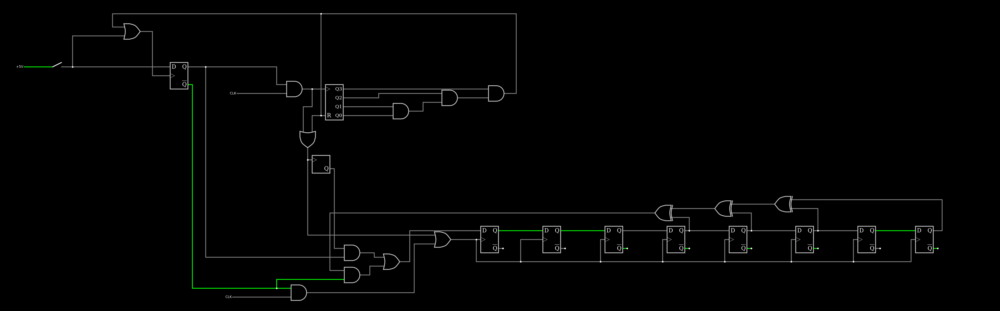

# Falstad.md
 is an online circuit simulator that allows users to design and simulate electronic circuits in a web browser environment.

## Linear Feedback Shift Register (LFSR)
A LFSR is a digital shift register capable of generating pseudo-random sequences. It operates by shifting its contents to the right and feeding back a linear combination of its bits to the input, producing a sequence that appears random. With a reset pin and an initial state set to 010101010, your LFSR would cycle through a pseudo-random sequence based on its feedback logic.

