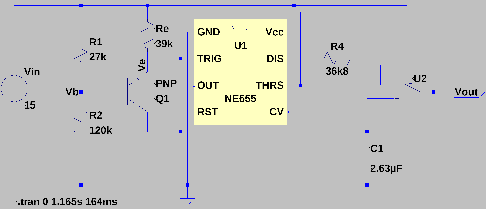
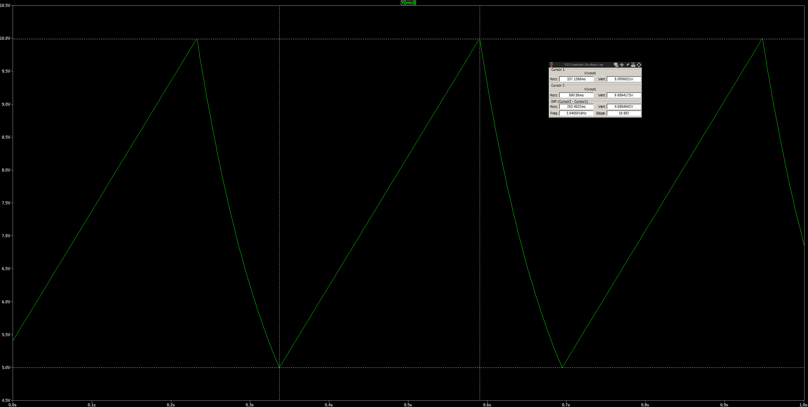
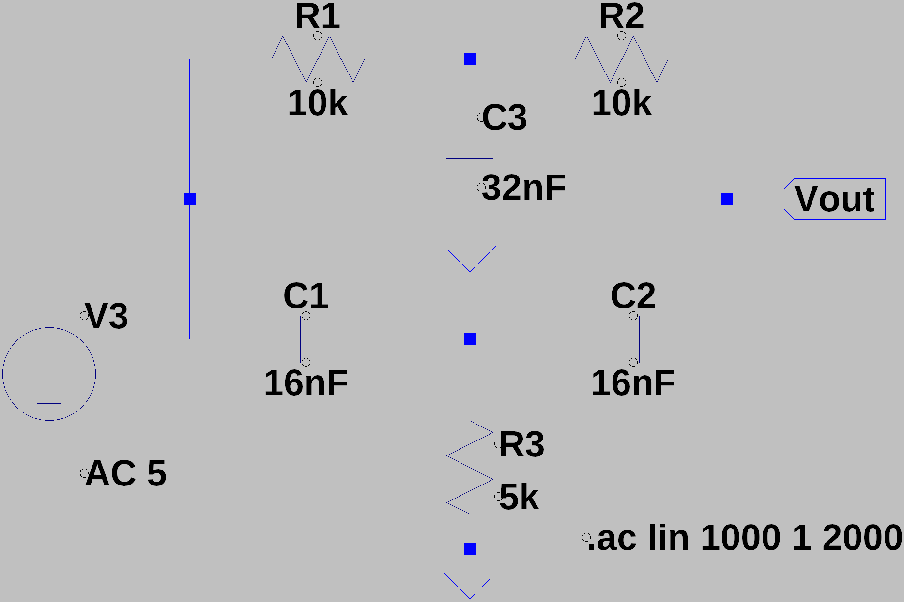
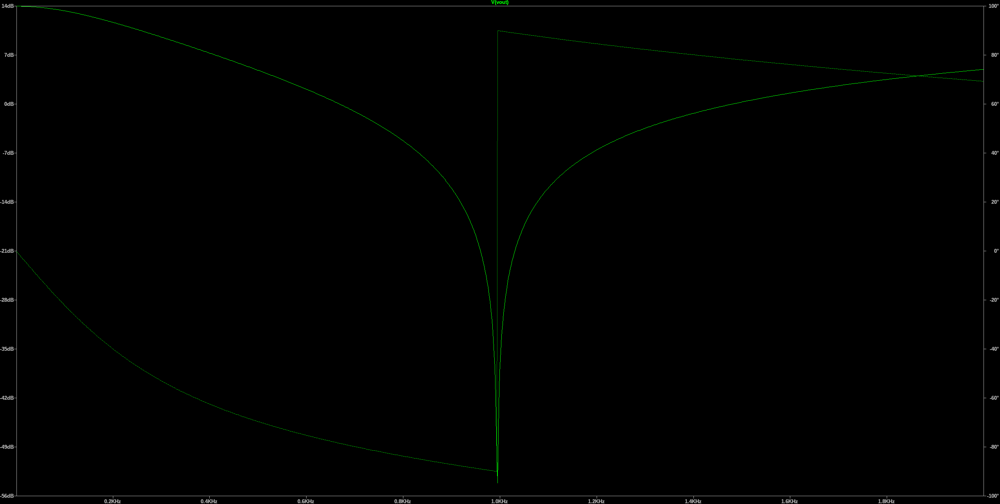
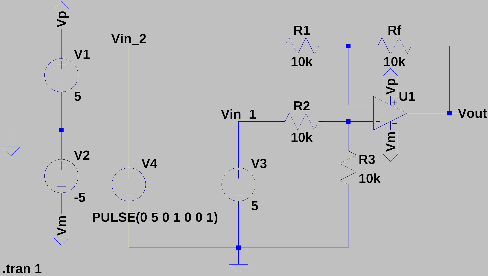
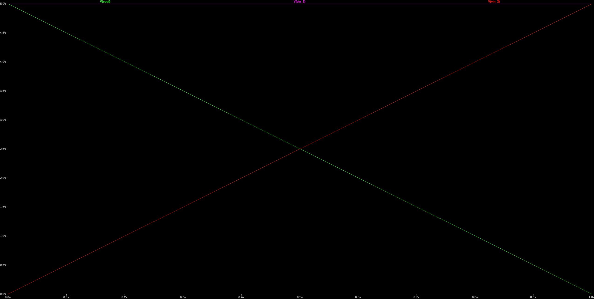

# LTSpice

## 555 Sawtooth Oscillator
As explained by [1, p430], the 555 sawtooth oscillator uses the 555 timer IC to generate a repeating sawtooth waveform. This configuration exploits the charging and discharging cycles of a capacitor through the 555 timer, providing an adjustable frequency and amplitude.

### Equation
The operational characteristics of the 555 sawtooth oscillator are described by the following equations:

Voltage at the base:
$$V_b = V_{\text{in}} \left(\frac{R_2}{R_1 + R_2}\right)$$

Voltage at the emitter:
$$V_e = V_b - V_{be} = V_b + 0.7$$

Current through the emitter:
$$I = \left(\frac{V_{\text{in}} - V_e}{R_e}\right)$$

Rise time:
$$T_{\text{rise}} = \left(\frac{C_1 \cdot V_{\text{in}}}{3 \cdot I}\right)$$

Fall time:
$$T_{\text{fall}} = R_4 \cdot C_1 \cdot \ln(2)$$

### Circuit

### Response

## Passive Twin Notch Filter
As explained in in [1, p. 414], a passive twin notch filter utilizes a pair of RC networks designed to cancel out a specific frequency, known as the notch frequency. This filter configuration is ideal for applications where elimination of a specific interference frequency is critical, such as in audio processing and radio frequency applications.

### Equations

Notch Frequency:
$$f_c = \frac{1}{2\pi RC}$$

Where:
- $f_c$ is the notch (cutoff) frequency where the attenuation is maximum.
- $R$ represents the resistance in ohms.
- $C$ represents the capacitance in farads.

The filter achieves its notch effect by summing two signals that are 180° out of phase at the cutoff frequency. This results in a destructive interference at $f_c$, effectively attenuating the signal at this frequency.

### Circuit
In the twin T-notch filter configuration, components are related as follows:

- Resistors $R_1$ and $R_2$ are equal to $R$.
- Capacitors $C_1$ and $C_2$ are equal to $C$.
- Resistor $R_3$ is half the resistance of $R$, $R_3 = \frac{R}{2}$
- Capacitor $C_3$ is twice the capacitance of $C$, $C_3 = 2C$

### Response

## Differential Amplifier
A differential amplifier is an operational amplifier circuit that amplifies the difference between two input voltages as demonstrated in [1, p. 348]. This type of amplifier is crucial for applications where the suppression of common-mode signals and the amplification of differential signals are required, such as in sensor signal conditioning and data acquisition systems.

### Equations

Output Voltage:
$$V_{\text{out}} = (Vin_2 - Vin_1) \cdot \left(\frac{R_f}{R_1}\right)$$

Where:
- $Vin_1$ and $Vin_2$ are the input voltages at the inverting and non-inverting inputs, respectively.
- $R_f$ is the feedback resistor connected between the output and the inverting input.
- $R_1$ represents the resistor connected to the inverting input.
- $R_1$=$R_2$=$R_3$

The gain of the differential amplifier, which is the factor by which the difference between the input voltages is amplified, can be expressed as:
$$\text{Gain} = \frac{R_f}{R_1}$$

### Circuit

### Response

## Summing Amplifier

A summing amplifier is an operational amplifier circuit used to combine multiple input voltages into a single output voltage that is the weighted sum of the input voltages, without inverting the signal. This type of amplifier is widely used in audio mixing and signal processing.

### Equations

The output voltage for a non-inverting summing amplifier can be calculated using the following formula:

Output Voltage:
$$V_{\text{out}} = V_{\text{ref}} + \left(\frac{R_f}{R_1} \cdot V_1 + \frac{R_f}{R_2} \cdot V_2 + \ldots + \frac{R_f}{R_n} \cdot V_n\right)$$

### Circuit

### Response

## Buck-Boost Converter

A Buck-Boost Converter is a type of DC-DC converter circuit that can step-up or step-down the input voltage to achieve the desired output voltage level, commonly used in power supply and battery charging applications.

### Equations

Output Voltage in Buck Mode:
$$V_{\text{out}} = V_{\text{in}} \cdot \left(1 - \frac{D}{100}\right) \cdot \frac{1}{1 - D}$$

Output Voltage in Boost Mode:
$$V_{\text{out}} = V_{\text{in}} \cdot \frac{1}{1 - D}$$

Duty Cycle:
$$D = \frac{V_{\text{out}}}{V_{\text{in}} - V_{\text{out}}}$$

Inductor Value:
$$L = \frac{(V_{\text{in}} - V_{\text{out}}) \cdot (V_{\text{out}} \cdot D)}{f_s \cdot I_L \cdot V_{\text{ripple}}}$$

Output Capacitor Value:

$$C = \frac{I_L \cdot (1 - D)}{f_s \cdot V_{\text{ripple}}}$$

Switching Frequency:
$$f_s = \frac{1}{T_s} = \frac{V_{\text{in}} - V_{\text{out}}}{V_{\text{in}} \cdot L \cdot I_L}$$

Output Current:
$$I_{\text{out}} = \frac{V_{\text{out}}}{R_{\text{load}}}$$

Voltage Ripple:
$$V_{\text{ripple}} = \frac{V_{\text{out}} \cdot (1 - D)}{2 \cdot f_s \cdot L \cdot I_L}$$

Peak Inductor Current:
$$I_{L_{\text{peak}}} = I_L \cdot (1 - D) + \frac{V_{\text{out}}}{L \cdot f_s}$$

### Circuit

### Response

## Wein-Bridge Oscillator
A Wein Bridge Oscillator is an electronic circuit that generates sinusoidal waves using a bridge configuration of resistors and capacitors, commonly employed in audio and low-frequency signal applications.

### Equations
Frequency of Oscillation:
$$f_{\text{Hz}} = \frac{1}{2\pi R C}$$

Stable Oscillation Condition:
$$R_b = \frac{R_f}{2}$$

Calculate \( $R_f$ \):
$$R_f =\frac{1}{2 \pi  f_{\text{Hz}} C }$$

Calculate \( $R_b$ \):
$$R_b = \frac{R_f}{2}$$

### Circuit

### Response

# References

[1] Horowitz, P., and Hill, W., 2015. The Art of Electronics. 3rd ed. Cambridge: Cambridge University Press.