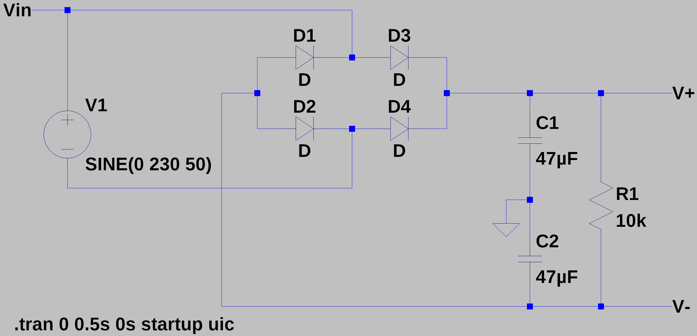
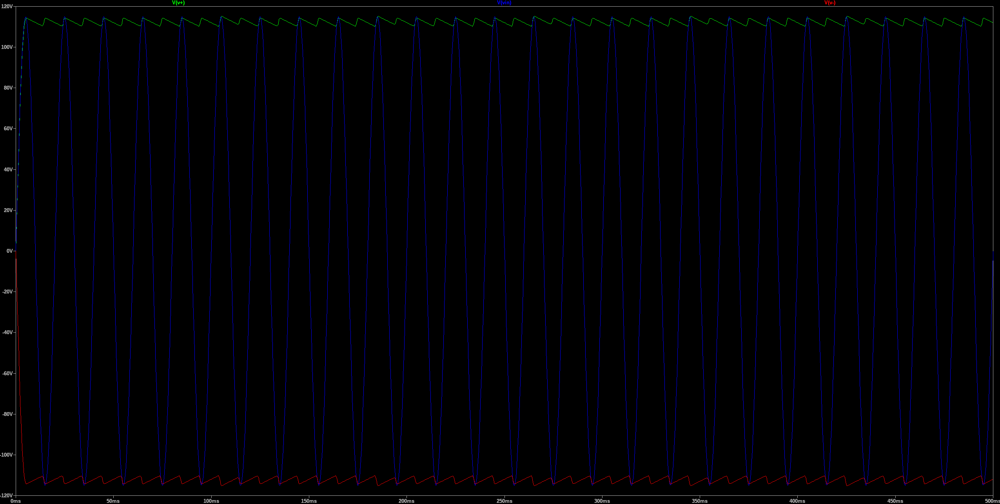
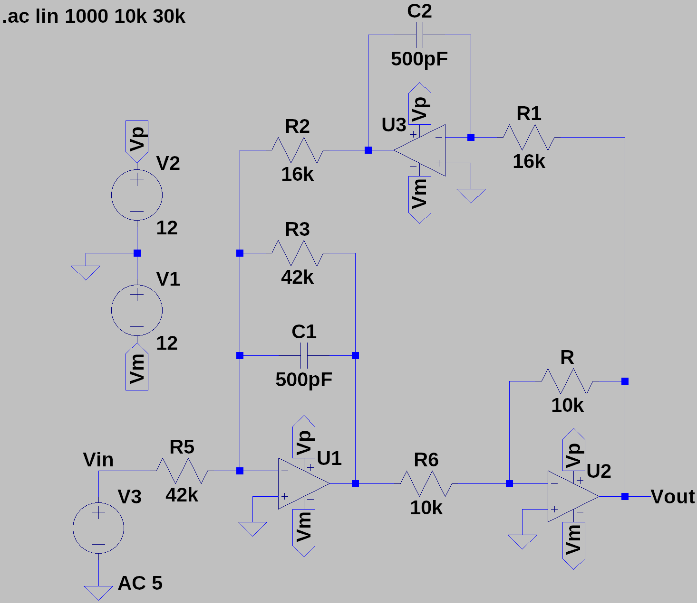
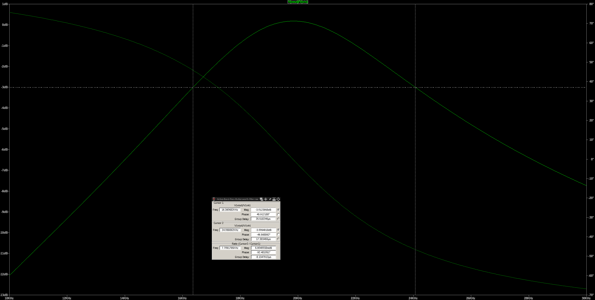
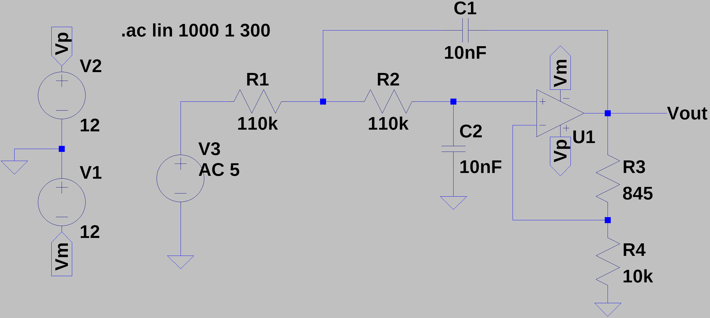
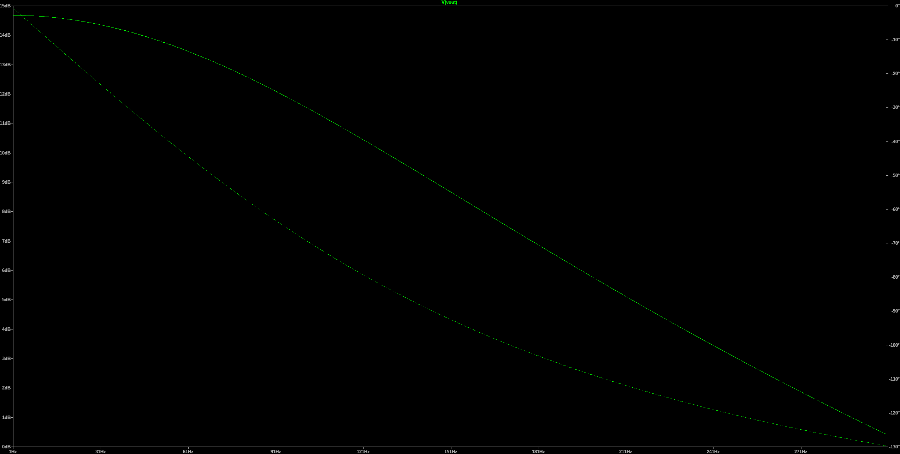

# LTSpice
## Center-Tapped Full-Wave Rectifier
As described in [1, p33], a split-supply center-tapped full-wave rectifier is an efficient circuit that utilizes both halves of the AC input waveform to generate dual polarity outputs (positive and negative voltages). This configuration often includes a transformer with a center tap and uses diodes to rectify the AC input, making it ideal for applications requiring dual supply voltages such as operational amplifiers and mixed-signal processing circuits.

RMS Output Voltage (Vrms)
$$V_{\text{rms}} = \frac{V_{\text{sec}}}{\sqrt{2}}$$

Ripple Voltage (V_ripple)
$$V_{\text{ripple}} = \frac{I_{\text{load}}}{f C R_{\text{load}}}$$

where:
- $I_{\text{load}}$ is the load current,
- $f$ is the frequency of the AC supply,
- $C$ is the capacitance of the filter capacitor,
- $R_{\text{load}}$ is the load resistance.

### Circuit

### Response

## Biquad Active Filter
As described in [1, p411], a biquad filter is an active filter circuit using operational amplifiers, capacitors, and resistors to achieve a versatile and precise frequency response. This second-order filter configuration allows for easy adjustment of parameters like quality factor, gain, and bandwidth, making it ideal for various audio and signal processing applications.

### Equations
Center Frequency:
$$f_0 = \frac{1}{2\pi R_F C}$$

Quality Factor:
$$Q = \frac{f_0}{BW}$$

Bandwidth:
$$BW = \frac{1}{2\pi R_B C}$$

Resistor for Gain:
$$R_G = \frac{R_B}{G}$$

Resistor for Bandwidth:
$$R_B = \frac{1}{2\pi BW C}$$

Resistor for Center Frequency:
$$R_F = \frac{1}{2\pi f_0 C}$$

Gain:
$$G = \frac{R_B}{R_G}$$

### Circuit
As outlined in [1, p411], the design procedure is as follows: 
1. Choose an op-amp whose bandwidth $f_T$ is at least 10 to 20 times the product of the gain $G$ and the center frequency $f_0$.
   $$ f_T \geq 10 \times G \times f_0 $$

2. Pick a round-number capacitor value in the vicinity of:
   $$C = \frac{10}{f_0} \text{μF}$$
   where $f_0$ is in Hz.

3. Use the desired center frequency to calculate the corresponding $R_F$ from Equation 6.15:
   $$R_F = \frac{1}{2\pi f_0 C}$$

4. Use the desired bandwidth to calculate $R_B$:
   $$R_B = \frac{1}{2\pi BW C}$$

5. Use the desired band-center gain to calculate $R_G$:
   $$R_G = \frac{R_B}{G}$$

| Component | Description           | Circuit Mapping |
|-----------|-----------------------|-----------------|
| $R_F$ | Resistor for $f_0$| $R_1$, $R_2$ |
| $C$   | Capacitor             | $C_1$, $C_2$ |
| $R_G$ | Resistor for Gain     | $R5$         |
| $R_B$ | Resistor for Bandwidth| $R_3$        |
  

### Response

## Active Low-Pass Buttersworth Filter
As described in [1, p406], an active low-pass Butterworth filter typically incorporates operational amplifiers to achieve a maximally flat frequency response in the passband. This configuration utilizes a series of capacitors and resistors to form a filter circuit that attenuates higher frequencies above a certain cutoff. The design ensures minimal ripple in the passband, maintaining a smooth response across the frequency spectrum.

Cutoff Frequency:
$$RC = \frac{1}{2 \pi c_n f_c}$$

Where:
- $RC$ is the time constant of the filter.
- $c_n$ is a normalization constant derived from the Butterworth polynomial which defines the filter's frequency response. It is chosen based on the desired filter order and the characteristics of the passband, ensuring the filter's frequency response is as flat as possible within the passband (see [1, p408]).
- $f_c$ is the cutoff frequency, below which signals pass with little attenuation.

The equation describes how the product of resistance ($R$) and capacitance ($C$) determines the cutoff frequency, which is critical in defining the bandwidth of the filter.

### Circuit
In the active Butterworth low-pass filter configuration, components are related as follows:

- Resistors $R_1$, $R_2$, and $R_4$ are equal, denoted by $R$.
- Capacitors $C_1$ and $C_2$ are equal, denoted by $C$.
- Resistor $R_3$ is adjusted based on the gain factor $K$, with $R_3 = (K-1)R$.

### Response

## 555 Sawtooth Oscillator
As explained by [1, p430], the 555 sawtooth oscillator uses the 555 timer IC to generate a repeating sawtooth waveform. This configuration exploits the charging and discharging cycles of a capacitor through the 555 timer, providing an adjustable frequency and amplitude.

### Equations
The operational characteristics of the 555 sawtooth oscillator are described by the following equations:

Voltage at the base:
$$V_b = V_{\text{in}} \left(\frac{R_2}{R_1 + R_2}\right)$$

Voltage at the emitter:
$$V_e = V_b - V_{be} = V_b + 0.7$$

Current through the emitter:
$$I = \left(\frac{V_{\text{in}} - V_e}{R_e}\right)$$

Rise time:
$$T_{\text{rise}} = \left(\frac{C_1 \cdot V_{\text{in}}}{3 \cdot I}\right)$$

Fall time:
$$T_{\text{fall}} = R_4 \cdot C_1 \cdot \ln(2)$$

### Circuit

### Response

## Passive Twin Notch Filter
As explained in in [1, p. 414], a passive twin notch filter utilizes a pair of RC networks designed to cancel out a specific frequency, known as the notch frequency. This filter configuration is ideal for applications where elimination of a specific interference frequency is critical, such as in audio processing and radio frequency applications.

### Equations

Notch Frequency:
$$f_c = \frac{1}{2\pi RC}$$

Where:
- $f_c$ is the notch (cutoff) frequency where the attenuation is maximum.
- $R$ represents the resistance in ohms.
- $C$ represents the capacitance in farads.

The filter achieves its notch effect by summing two signals that are 180° out of phase at the cutoff frequency. This results in a destructive interference at $f_c$, effectively attenuating the signal at this frequency.

### Circuit
In the twin T-notch filter configuration, components are related as follows:

- Resistors $R_1$ and $R_2$ are equal to $R$.
- Capacitors $C_1$ and $C_2$ are equal to $C$.
- Resistor $R_3$ is half the resistance of $R$, $R_3 = \frac{R}{2}$
- Capacitor $C_3$ is twice the capacitance of $C$, $C_3 = 2C$

### Response

## Differential Amplifier
A differential amplifier is an operational amplifier circuit that amplifies the difference between two input voltages as demonstrated in [1, p. 348]. This type of amplifier is crucial for applications where the suppression of common-mode signals and the amplification of differential signals are required, such as in sensor signal conditioning and data acquisition systems.

### Equations

Output Voltage:
$$V_{\text{out}} = (Vin_2 - Vin_1) \cdot \left(\frac{R_f}{R_1}\right)$$

Where:
- $Vin_1$ and $Vin_2$ are the input voltages at the inverting and non-inverting inputs, respectively.
- $R_f$ is the feedback resistor connected between the output and the inverting input.
- $R_1$ represents the resistor connected to the inverting input.
- $R_1$=$R_2$=$R_3$

The gain of the differential amplifier, which is the factor by which the difference between the input voltages is amplified, can be expressed as:
$$\text{Gain} = \frac{R_f}{R_1}$$

### Circuit

### Response

## Summing Amplifier

A summing amplifier is an operational amplifier circuit used to combine multiple input voltages into a single output voltage that is the weighted sum of the input voltages, without inverting the signal. This type of amplifier is widely used in audio mixing and signal processing.

### Equations

The output voltage for a non-inverting summing amplifier can be calculated using the following formula:

Output Voltage:
$$V_{\text{out}} = V_{\text{ref}} + \left(\frac{R_f}{R_1} \cdot V_1 + \frac{R_f}{R_2} \cdot V_2 + \ldots + \frac{R_f}{R_n} \cdot V_n\right)$$

### Circuit

### Response

## Buck-Boost Converter

A Buck-Boost Converter is a type of DC-DC converter circuit that can step-up or step-down the input voltage to achieve the desired output voltage level, commonly used in power supply and battery charging applications.

### Equations

Output Voltage in Buck Mode:
$$V_{\text{out}} = V_{\text{in}} \cdot \left(1 - \frac{D}{100}\right) \cdot \frac{1}{1 - D}$$

Output Voltage in Boost Mode:
$$V_{\text{out}} = V_{\text{in}} \cdot \frac{1}{1 - D}$$

Duty Cycle:
$$D = \frac{V_{\text{out}}}{V_{\text{in}} - V_{\text{out}}}$$

Inductor Value:
$$L = \frac{(V_{\text{in}} - V_{\text{out}}) \cdot (V_{\text{out}} \cdot D)}{f_s \cdot I_L \cdot V_{\text{ripple}}}$$

Output Capacitor Value:

$$C = \frac{I_L \cdot (1 - D)}{f_s \cdot V_{\text{ripple}}}$$

Switching Frequency:
$$f_s = \frac{1}{T_s} = \frac{V_{\text{in}} - V_{\text{out}}}{V_{\text{in}} \cdot L \cdot I_L}$$

Output Current:
$$I_{\text{out}} = \frac{V_{\text{out}}}{R_{\text{load}}}$$

Voltage Ripple:
$$V_{\text{ripple}} = \frac{V_{\text{out}} \cdot (1 - D)}{2 \cdot f_s \cdot L \cdot I_L}$$

Peak Inductor Current:
$$I_{L_{\text{peak}}} = I_L \cdot (1 - D) + \frac{V_{\text{out}}}{L \cdot f_s}$$

### Circuit

### Response

## Wein-Bridge Oscillator
A Wein Bridge Oscillator is an electronic circuit that generates sinusoidal waves using a bridge configuration of resistors and capacitors, commonly employed in audio and low-frequency signal applications.

### Equations
Frequency of Oscillation:
$$f_{\text{Hz}} = \frac{1}{2\pi R C}$$

Stable Oscillation Condition:
$$R_b = \frac{R_f}{2}$$

Calculate $ $R_f$ $:
$$R_f =\frac{1}{2 \pi  f_{\text{Hz}} C }$$

Calculate $ $R_b$ $:
$$R_b = \frac{R_f}{2}$$

### Circuit

### Response

# References

[1] Horowitz, P., and Hill, W., 2015. The Art of Electronics. 3rd ed. Cambridge: Cambridge University Press.