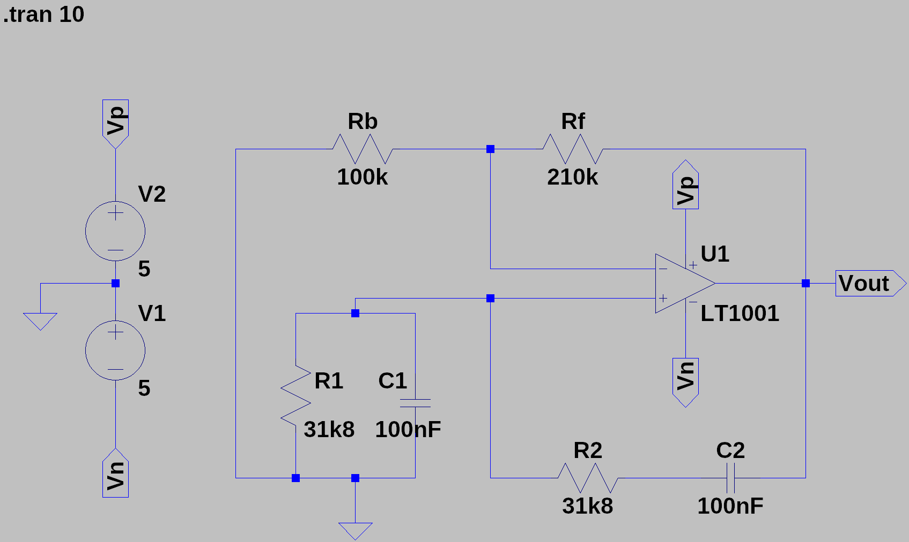

# LTSpice
## Summing Amplifier

A summing amplifier is an operational amplifier circuit used to combine multiple input voltages into a single output voltage that is the weighted sum of the input voltages, without inverting the signal. This type of amplifier is widely used in audio mixing and signal processing.

### Equations

The output voltage for a non-inverting summing amplifier can be calculated using the following formula:

Output Voltage:
$$V_{\text{out}} = V_{\text{ref}} + \left(\frac{R_f}{R_1} \cdot V_1 + \frac{R_f}{R_2} \cdot V_2 + \ldots + \frac{R_f}{R_n} \cdot V_n\right)$$

### Circuit

### Response

## Buck-Boost Converter

A Buck-Boost Converter is a type of DC-DC converter circuit that can step-up or step-down the input voltage to achieve the desired output voltage level, commonly used in power supply and battery charging applications.

### Equations

Output Voltage in Buck Mode:
$$V_{\text{out}} = V_{\text{in}} \cdot \left(1 - \frac{D}{100}\right) \cdot \frac{1}{1 - D}$$

Output Voltage in Boost Mode:
$$V_{\text{out}} = V_{\text{in}} \cdot \frac{1}{1 - D}$$

Duty Cycle:
$$D = \frac{V_{\text{out}}}{V_{\text{in}} - V_{\text{out}}}$$

Inductor Value:
$$L = \frac{(V_{\text{in}} - V_{\text{out}}) \cdot (V_{\text{out}} \cdot D)}{f_s \cdot I_L \cdot V_{\text{ripple}}}$$

Output Capacitor Value:

$$C = \frac{I_L \cdot (1 - D)}{f_s \cdot V_{\text{ripple}}}$$

Switching Frequency:
$$f_s = \frac{1}{T_s} = \frac{V_{\text{in}} - V_{\text{out}}}{V_{\text{in}} \cdot L \cdot I_L}$$

Output Current:
$$I_{\text{out}} = \frac{V_{\text{out}}}{R_{\text{load}}}$$

Voltage Ripple:
$$V_{\text{ripple}} = \frac{V_{\text{out}} \cdot (1 - D)}{2 \cdot f_s \cdot L \cdot I_L}$$

Peak Inductor Current:
$$I_{L_{\text{peak}}} = I_L \cdot (1 - D) + \frac{V_{\text{out}}}{L \cdot f_s}$$

### Circuit

### Response

## Wein-Bridge Oscillator
A Wein Bridge Oscillator is an electronic circuit that generates sinusoidal waves using a bridge configuration of resistors and capacitors, commonly employed in audio and low-frequency signal applications.

### Equations
Frequency of Oscillation:
$$f_{\text{Hz}} = \frac{1}{2\pi R C}$$

Stable Oscillation Condition:
$$R_b = \frac{R_f}{2}$$

Calculate \( $R_f$ \):
$$R_f =\frac{1}{2 \pi  f_{\text{Hz}} C }$$

Calculate \( $R_b$ \):
$$R_b = \frac{R_f}{2}$$

### Circuit

### Response

