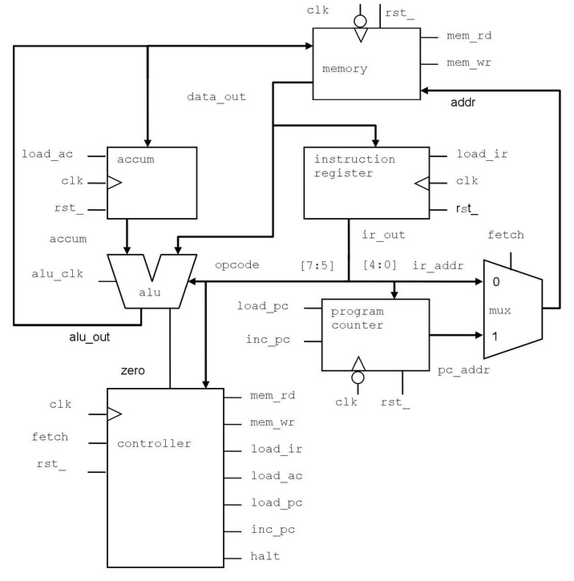

# VeriRISC Processor
The following code was generated as guided by the Cadence SystemVerilog for Design and Verification v21.10 found [here](https://www.cadence.com/en_US/home/training/all-courses/82143.html).

The following files were provided to ensure that the developed VeriRISC processor functioned correctly:
- response.pat
- stimulus.pat
- CPUtest1.dat
- CPUtest2.dat
- CPUtest3.dat

# VeriRISC Diagram
The following is a diagram of the constructed VeriRISC processor.

