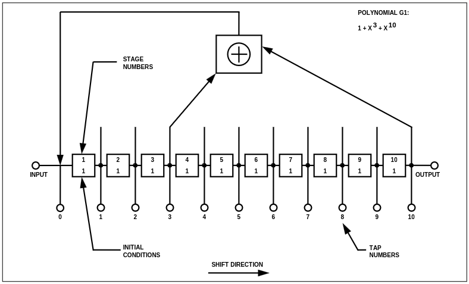

 # GPS
 ## L1 C/A Code Generator
This module implements a GPS L1 C/A (Coarse/Acquisition) code generator. The C/A code is a pseudorandom noise sequence that repeats every 1023 chips and is used for signal acquisition and tracking in GPS receivers.
The output is calculated by XORing the last bit of the G1 register with the selected taps from the G2 register based on the satellite's configuration.
The satellite and tap code information are retrieved from [1, p6-7], and the C/A code generation scheme is outlined in [1, p27-30].

### Module Declaration
```verilog
module l1ca_generator(
        input clk,
        input set,
        input rst,
        input [0:9] in_taps,
        output reg out
);
```

### L1 C/A G1 Shift Register
 

### L1 C/A G2 Shift Register
 

## References
[1] IS-GPS-200M, https://www.gps.gov/technical/icwg/IS-GPS-200M.pdf