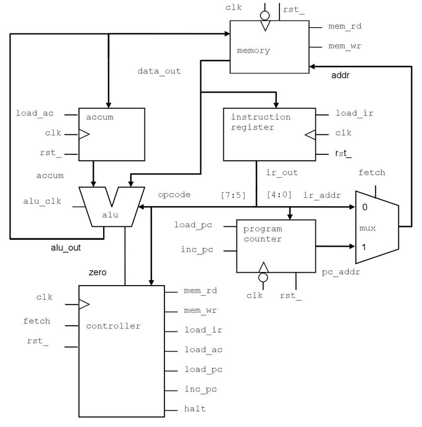

# VeriRISC Processor
The following code was generated as guided by the Cadence Verilog Language and Application v28.0 found [here](https://www.cadence.com/en_US/home/training/all-courses/82110.html).

# VeriRISC Diagram
The following is a diagram of the constructed VeriRISC processor.

